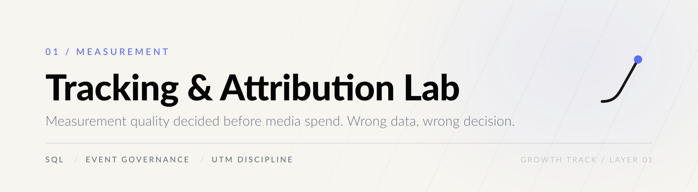
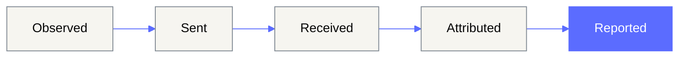
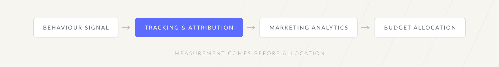

<p align="center">
  <picture>
    <source media="(prefers-color-scheme: dark)" srcset="assets/brand/header-dark.svg">
    
  </picture>
</p>

<p align="center">
  
  
  
</p>

**Measurement quality is the first budget decision.** Every optimisation downstream inherits the
quality of the events defined here. If the event layer is wrong, better bidding only buys the wrong
outcome faster.

---

## 01 — The decision this supports

Before a campaign is judged, one question has to be answerable: *can this number be trusted?*

This lab makes the measurement layer explicit — what an event is, where it can be lost, and which
checks catch the loss — so that a CPA or ROAS figure can be defended rather than assumed.

---

## 02 — Event lifecycle

A conversion is not one thing. It is five states, and a number can break at any of them.



| State | Definition |
| --- | --- |
| **Observed** | User or system behaviour that happened in the product or site. |
| **Sent** | Payload emitted by browser, server, app or integration. |
| **Received** | Payload accepted by analytics, ad platform or warehouse endpoint. |
| **Attributed** | Received event linked to a campaign, click, session or source. |
| **Reported** | Metric surfaced in a dashboard after attribution windows, deduplication and filtering. |

The gap between **Observed** and **Reported** is where most disputed numbers live.

Full definitions: [`docs/event-lifecycle.md`](docs/event-lifecycle.md).

---

## 03 — What this repository demonstrates

| Theme | Why it matters |
| --- | --- |
| Event lifecycle | Names the stage at which a number is lost, instead of blaming the platform. |
| UTM governance | Without a naming contract, campaigns cannot be compared across sources. |
| Quality checks in SQL | Duplicate events, missing campaign parameters and source inconsistency, caught before reporting. |

---

## 04 — How to read it

This repository is documentation and SQL first. There is no application to run.

```bash
# the three checks, written against a generic warehouse schema
cat sql/event_quality_checks.sql
```

| Path | Contents |
| --- | --- |
| [`sql/event_quality_checks.sql`](sql/event_quality_checks.sql) | Missing campaign parameters, duplicate conversions, platform/source consistency. |
| [`docs/event-lifecycle.md`](docs/event-lifecycle.md) | The five states and their definitions. |
| [`docs/source-review.md`](docs/source-review.md) | What was found in the audited repositories and why only generic content was migrated. |

Table and column names are placeholders. Replace them with your warehouse schema before running.

---

## 05 — Limitations

Stated plainly, because an audit that hides its own boundaries is not an audit.

- The checks are **generic**. They assume a `marketing_events`-shaped table and are meant to be adapted.
- The source roadmap belonged to a **private product repository** and was not copied; this lab converts
  the recurring themes into publishable documentation.
- Nothing here measures attribution *accuracy*. It measures whether the event layer is internally
  consistent enough for an attribution model to be worth running.

---

## Growth track

<p align="center">
  <picture>
    <source media="(prefers-color-scheme: dark)" srcset="assets/brand/chain-dark.svg">
    
  </picture>
</p>

<p align="center">
  <a href="https://github.com/arielabade/marketing-analytics-portfolio">Next layer: Marketing Analytics Portfolio</a>
  &nbsp;·&nbsp;
  <a href="https://github.com/arielabade">Portfolio overview</a>
</p>
